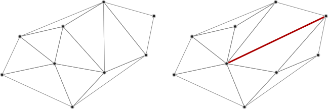
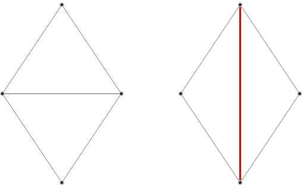

Constrainautor
==============

A small library for constraining triangulations from [Delaunator](https://github.com/mapbox/delaunator).

Example
-------

Constrainautor takes a Delaunay triangulation (from Delaunator), and turns it
into a *constrained* (*conforming*) triangulation. You specify two points in the
triangulation, and Constrainautor ensures there is an edge between those points.

	// A diamond
	const points = [[150, 50], [50, 200], [150, 350], [250, 200]],
		// Creates a horizontal edge in the middle
		del = Delaunator.from(points),
		con = new Constrainautor(del);
	
	// .. but we want a vertical edge, from [150, 50] to [150, 350]:
	con.constrainOne(0, 2);
	con.delaunify();
	// del now has the constrained triangulation, in the same format that
	// Delaunator outputs

Install
-------

Install from NPM:

	npm install @kninnug/constrainautor
	
Use in Node.js:

	const Constrainautor = require('@kninnug/constrainautor');
	
or as an ECMAScript/ES6 module:

	import Constrainautor from '@kninnug/constrainautor';

or in the browser:

	

or minified:

	

The Constrainautor library does not depend on Delaunator itself, but the input
is expected to be in the format that Delaunator outputs.

Usage
-----

Besides being in the format that Delaunator outputs, the library has these other
requirements on the input data:

- Points are not duplicated, i.e. no two points have the same x and y coordinates.
- No two constrained edges intersect with eachother.
- Constrained edges do not intersect with any point in the triangulation (beside
  their end-points).

If one or more of these requirements are not met, the library may throw an error
during constrainment, or produce bogus results.
  
To triangulate a set of points, and constrain certain edges:

0. Define the points to be triangulated: `points = [[x1, y1], [x2, y2], ...]`.
1. Generate a triangulation (using Delaunator): `del = Delaunator.from(points)`.
2. Make a constrainer: `con = new Constrainautor(del)`. Note that `del` will be
   modified by the Constrainautor methods.
3. Define the edges to be constrained: `edges = [[0, 1], [3, 4], ...]`. These are
   indices into the `points` array.
4. Constrain the triangulation: `for(const [p1, p2] of edges){ con.constrainOne(p1, p2); }`.
5. Restore the Delaunay condition: `con.delaunify()`.

Alternatively, you can call `con.constrainAll(edges)`, which will constrain all
the edges in the supplied array and call `delaunify`.

You can then use the triangulation in `del` as described in the [Delaunator
guide](https://mapbox.github.io/delaunator/).

If you change the point coordinates and their triangulation (via `Delaunator#update`),
you need to re-constrain the edges by creating a `new Constrainautor` and going
through steps 3 - 5 again.

API reference
-------------

More details can be found in the comments of `Constrainautor.mjs`.

### con = new Constrainautor(del)

Construct a new Constrainautor from the given triangulation. The `del` object
should be returned from Delaunator, and is modified in-place by the 
Constrainautor methods.

#### con.constrainOne(p1, p2)

Constrain an edge in the triangulation. The arguments `p1` and `p2` must be
indices into the `points` array originally supplied to the Delaunator. It 
returns the id of the half-edge that points from `p1` to `p2`, or the negative
id of the half-edge that points from `p2` to `p1`.

#### con.delaunify(force = false)

After constraining edges, call this method to restore the Delaunay condition
(for every two triangles sharing an edge, neither lies completely within the
circumcircle of the other), for every edge that was flipped by `constrainOne`.
If `force` is `true`, it will check & correct every non-constrained edge
(regardless of whether it was touched by `constrainOne`).

#### con.constrainAll(edges)

A shortcut to constraining an array of edges by `constrainOne` and calling
`delaunify` afterwards. The argument `edges` must be an array of arrays of 
indices into the `points` array originally supplied to Delaunator, i.e:
`[[p1, p2], [p3, p4], ...]`. Returns the updated `del` object.

Details
-------

At construction time, the Constrainautor library allocates two arrays, in 
addition to the arrays already present in the Delaunator output:

- `vertMap`: a mapping of each point (vertex) in the triangulation to the (id of
  the) left-most edge that points to that vertex. This is used to find the edges
  connected to any given point.
- `flips`: keeps track of the edges that were flipped or constrained. It is used
  by `delaunify` to determine which edges may need to be flipped again to 
  restore the Delaunay condition.
  
During the constraining process, or the re-Delaunay-fying afterwards, the 
library does no dynamic allocations. This is also the reason that `constrainOne`
does not restore the Delaunay condition immediately, as that would require 
keeping track of an unbounded list of flipped edges. Rather, it sets `flips` to
1 at the index of each newly created edge, which `delaunify` iterates over to
check and restore the Delaunay condition.

Known issues
------------

- `delaunify` might not restore the Delaunay condition for all triangle pairs
  when that requires flipping edges more than once.

Attributions
------------

- The constraining algorithm is adapted from [A fast algorithm for generating constrained Delaunay triangulations](https://www.newcastle.edu.au/__data/assets/pdf_file/0019/22519/23_A-fast-algortithm-for-generating-constrained-Delaunay-triangulations.pdf), 1992, S. W. Sloan.
- Segment/segment intersection code adapted from [Gareth Rees on StackOverflow](https://stackoverflow.com/a/565282).
- Nearest point on segment code adapted from [Joshua on StackOverflow](https://stackoverflow.com/a/6853926).
- Point-in-circumcircle code taken from [Delaunator](https://github.com/mapbox/delaunator).
